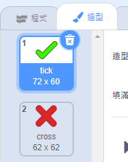

## 新增圖形

你的角色不僅僅能向玩家說 `是！:)` 或 `不是 :(` ，讓我們來新增一些圖形，使玩家瞭解他們的表現如何。

+ 建立一個被稱作“結果”的新子圖，其中包含一個“對號”和一個“錯號”裝扮。

	

+ 更改你角色的程式碼，使其不是告訴玩家做得如何，而是播放 `正確`{:class="blockevents"} 和 `錯誤`{:class="blockevents"} 訊息。

	

+ 你現在可以使用這些訊息顯示“對號”或“錯號”裝扮。向你的新“結果”子圖新增此程式碼：

	

+ 再次測試你的遊戲。你每次回答問題正確時就能看到一個對號，回答錯誤時為一個錯號！

	

+ 你是否注意到了 `我收到正確時`{:class="blockevents"} 和 `我收到錯誤時`{:class="blockevents"} 的程式碼幾乎一樣？讓我們來建立一個函式，使你更容易更改你的程式碼。

	在你的“結果”子圖上點選 `更多模組`{:class="blockmoreblocks"}，然後點選“製作模組”。建立一個被稱作 `製作動畫`{:class="blockmoreblocks"} 的新函式。

	

+ 你隨後可以將動畫程式碼新增進你的新動畫函式中，然後僅使用兩次函式：

	

+ 現在，如果你想讓對號和錯號顯示更長或更短時間，你只需對你的程式碼做出一處改動。試一試吧！

+ 你可以更改你的動畫函式，讓對號和錯號漸現，而不是僅僅顯示和隱藏。

	```blocks
		定義 (animate)
		效果 [虛像 v] 設為 (100)
		顯示
		重複 (25) 次 
  			效果 [虛像 v] 改變 (-4)
		end
		隱藏
	```


