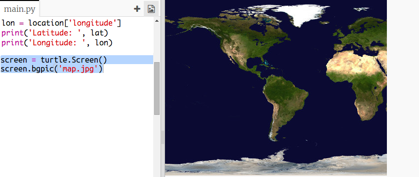
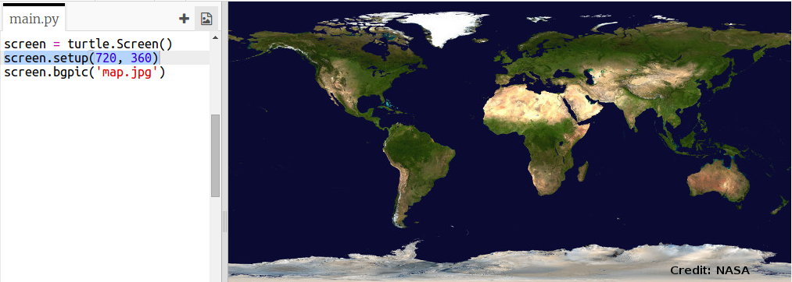

​## ISS 在哪裡？

國際太空站處於環繞地球的軌道內。它大約每隔一個半小時繞地球一週。ISS 以平均每秒 7.66 km 的速度前進。速度飛快！ 

讓我們使用另一個 web 服務來查詢國際太空站的位置。 


+ 首先在 web 瀏覽器的新選項卡中開啟該 web 服務的 url：<a href="http://api.open-notify.org/iss-now.json" target="_blank">http://api.open-notify.org/iss-now.json</a>
  
    你會看到類似於下文的內容：
  
    ```
    {
    "iss_position": {
      "latitude": 8.54938193505081, 
      "longitude": 73.16560793639105
    }, 
    "message": "success", 
    "timestamp": 1461931913
    }
    ```
  
    該結果包含 ISS 當前所處位置投影到地球上的點的座標。 

    經度是東-西位置，範圍是 -180 到 180。0 指貫穿英國倫敦格林威治的本初子午線。 

    緯度是南-北位置，範圍是 90 到 -90。0 指赤道。 

+ 現在你需要從 Python 呼叫同一個 web 服務。向你的指令碼末尾新增以下程式碼，以獲取 ISS 的當前位置：

    


+ 讓我們建立變數來儲存緯度和經度，並將其列印出來：

    

+ 將位置顯示在地圖上會更加有用。

    首先我們需要匯入turtle 模組。 
  
    
  
+ 讓我們載入一張世界地圖作為背景圖片，你的 trinket 中已經包含了一張。

    
  
    NASA 提供了這張漂亮的地圖並允許使用。 
  
    地圖居中於 0, 0，這正是你所需要的。 

+ 你需要設定畫面尺寸來適應圖片的尺寸，即 720 乘 360。 

    新增 `screen.setup(720, 360)`：

    
  
+ 你想要將turtle送到一個特定的緯度和經度。為了簡單起見，我們可以設定畫面來匹配我們使用的座標：

     
  
    現在座標將與我們從 web 服務獲得的經緯度座標相匹配。 

+ 讓我們為 ISS 建立一個turtle。 

    

    你的專案包括“iss.png”和“iss2.png”，兩張都嘗試一下，看你更喜歡哪張。 

+ ISS 從地圖的中心出發，現在讓我們把它移動到地圖上的正確位置：

    
  
    請注意通常首先給出的是緯度，但我們在繪製 (x,y) 座標時需要首先給出經度。 

+ 通過執行程式來進行測試。ISS 應移向其當前在地球上方對應的位置。 

    等待幾秒鐘再次執行你的程式，看看 ISS 會移向哪裡。 

    


